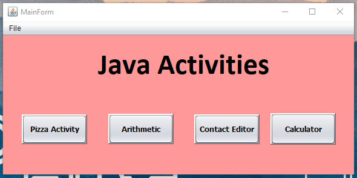
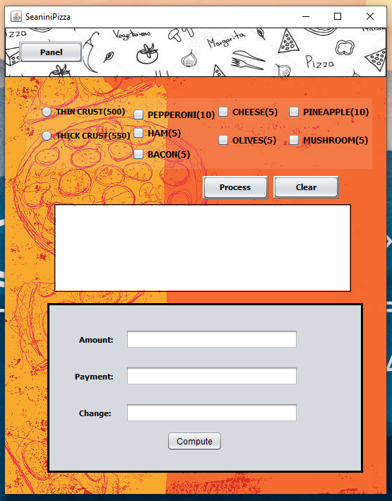
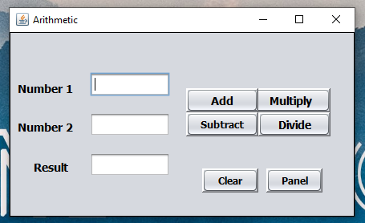
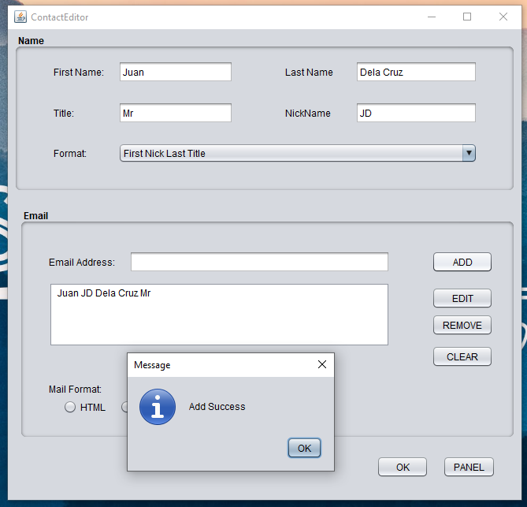
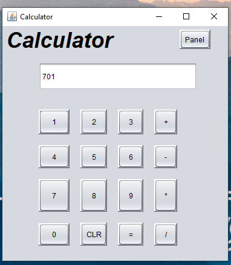

# :coffee: Java GUI Apps Netbeans

&nbsp;
&nbsp;

## :coffee:Activities Overview

#### :computer: _Main Panel_

    
Panel

    

#### :pizza: _Pizza Order Activity_

    
Pizza

    

#### 📱 _Arithmetic_

    
Arithmetic

    

#### :email: _Contact Editor_

    
Contact Editor

    

####  📟  _Calculator_

    
Calculator

    

